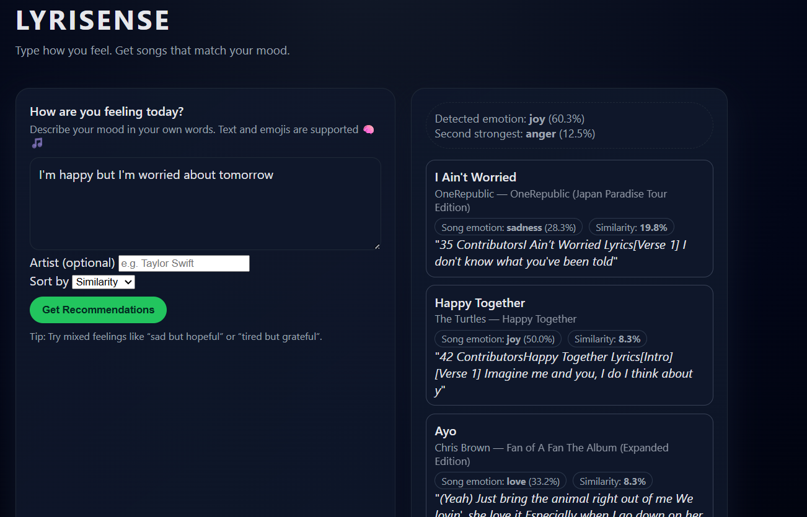

# 🎵 LyriSense – Mood-Based Music Recommendation Using AI & NLP

LyriSense is an AI-powered emotion-aware music recommender that analyzes user mood through natural language input and suggests songs whose lyrical content matches the emotional tone. It combines **NLP**, **machine learning**, **FastAPI**, **TF-IDF**, **cosine similarity**, and an interactive **frontend UI** to deliver personalized song recommendations.



---

## 🌟 Features

### 🎭 Emotion detection
- **Emotions:** joy, sadness, anger, fear, love, surprise
- **Model:** TF-IDF + Logistic Regression

### 🎵 Song recommendation engine
- **Dataset:** Cleaned and processed Spotify lyrics
- **Embeddings:** TF-IDF for all songs
- **Scoring:** Cosine similarity
- **Filtering:** Artist filter, popularity sort
- **Context:** Lyric snippets matched to mood

### ⚡ FastAPI backend
- **Endpoints:**
  - `POST /api/predict`
  - `POST /api/recommend`
  - `GET /health`

### 💻 Frontend UI
- **Stack:** HTML/CSS/JS
- **Behavior:** Live API calls
- **Display:** Emotion, confidence, similarity, snippets, artist, album

### 📊 Visualizations
- **Includes:** Word clouds, emotion distributions, confusion matrix, TF-IDF vocabulary size, similarity heatmaps, lyrics length distribution

---

## 🗂 Project structure

```
LyriSense/
│
├── app/                  # FastAPI backend
│   ├── main.py
│   ├── model_loader.py
│   └── requirements.txt
│
├── src/                  # Core AI/NLP logic
│   ├── model.py
│   ├── similarity.py
│   ├── spotify_helpers.py
│   ├── openai_helpers.py
│   ├── build_song_embeddings.py
│   ├── utils.py
│   └── __init__.py
│
├── data/
│   ├── raw/              # Original datasets
│   └── cleaned/          # Cleaned datasets + predictions
│
├── notebooks/            # Development notebooks
│   ├── 01_data_exploration.ipynb
│   ├── 02_preprocessing.ipynb
│   ├── 03_modeling.ipynb
│   └── 04_api_recommender.ipynb
│
├── models/               # Saved ML artifacts
│   ├── tfidf_emotion.joblib
│   ├── logreg_emotion.joblib
│   ├── song_tfidf_matrix.npz
│   └── song_embeddings_openai.npy (optional)
│
├── frontend/             # User interface
│   ├── index.html
│   ├── styles.css
│   └── script.js
│
├── results/              # Visualizations & demo screenshots
│   ├── plots/
│   └── demo_screenshots/
│
├── generate_plots.py     # Auto-generate visualizations
├── test_api.py           # Simple API test script
├── README.md
└── requirements.txt
```

---

## 🚀 Setup instructions

### Create a virtual environment
```bash
python -m venv venv
venv\Scripts\activate   # Windows
# or
source venv/bin/activate   # macOS/Linux
```

### Install requirements
```bash
pip install -r requirements.txt
```

### Download NLTK packages
```python
import nltk
nltk.download("punkt")
nltk.download("vader_lexicon")
```

### Run the FastAPI server
```bash
uvicorn app.main:app --reload
```
API docs: http://127.0.0.1:8000/docs

### Open frontend
Open `frontend/index.html` in your browser, or run a local server:
```bash
python -m http.server 5500
```

---

## 🧠 API endpoints

### POST /api/predict
**Input:**
```json
{
  "text": "I feel anxious but hopeful"
}
```
**Output:**
```json
{
  "emotion_id": 4,
  "emotion": "fear",
  "confidence": 0.82
}
```

### POST /api/recommend
**Input:**
```json
{
  "text": "I feel sad about everything",
  "top_k": 5,
  "same_emotion_only": true,
  "artist": null,
  "sort_by": "similarity"
}
```
**Returns:** Ranked songs with similarity score, predicted song emotion, lyric snippet, popularity, artist, album.

---

## 📊 Results (examples)

- **Emotion training distribution**
- **Song emotion predictions**
- **Confusion matrix**
- **Word clouds for all 6 emotions**
- **TF-IDF vocabulary size**
- **Similarity heatmap**
- **UI demo recommendations**

Screenshots are included in `results/demo_screenshots/`.

---

## 👥 Contributors

- **Dianne Buni — Data Processing & API Layer**
  - Dataset cleaning & preprocessing
  - Spotify API metadata
  - Dataframes & visualizations
  - Cleaning notebooks

- **Clara Yousif — AI/NLP & System Integration**
  - TF-IDF + logistic regression emotion model
  - Cosine similarity engine
  - FastAPI backend architecture
  - Vectorizer/model loading & caching
  - End-to-end integration

- **Sara Sanchez — Frontend & User Interaction**
  - HTML/CSS/JS UI
  - Fetch integration with FastAPI
  - Song cards, emotion display, snippets
  - Visual presentation & demo screenshots

---

## 🔮 Future enhancements

- OpenAI embeddings for deeper semantic similarity
- Live playlist export to Spotify
- Continuous mood tracking
- User profiles & personalization
- Multilingual emotion detection
- Deep learning emotion model (BERT, DistilBERT)

---

## 📄 License

This project is for academic purposes under Sheridan College PAIDA program.

---

## ⭐ Support the project

If you like LyriSense, please ⭐ the repo on GitHub!

---

